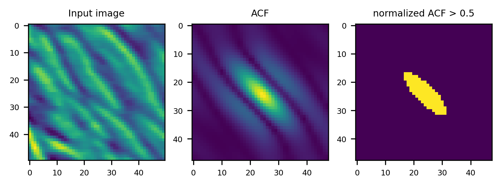

# pyfabric
Fabric tensor from 3D images.

pyfabric extracts the local fabric tensor from 3D image data.
pyfabric computes the 3D spatial **Auto Correlation Function (ACF)** to extract the local orientation and anisotropy of images.



The ACF of an image I is computed in the Fourier domain as: \
`ACF = |IFFT(FFT(I) conj(FFT(I)))|` 

with *FFT()* and *IFFT()* being the discrete Fourier and discrete inverse Fourier transforms of the image I, respectively [[1]](http://dx.doi.org/10.1016/j.actbio.2013.05.015) [[2]](https://doi.org/10.1117/12.596133) [[3]](https://doi.org/10.1016/j.bone.2009.07.001).
After this step, the ACF is segmented and an ellipsoid is fitted to its contour. The fabric tensor is obtained from the eigenvalues and eigenvectors of this ellipsoid. \
For a detailed explanation of the method see the notebook [pyfabric_demo](notebooks/pyfabric_demo.ipynb)

___

To view the help type
```
python pyfabric.py -h
```

Extract fabric information from an image *I*:
```
evecs, radii, evals, fabric_tensor_components, degree_anisotropy = pyfabric.fabric(I)
```
____
#### References:
[1] [P. Varga et al., “Investigation of the three-dimensional orientation of mineralized collagen fibrils in human lamellar bone using synchrotron X-ray phase nano-tomography,” Acta Biomaterialia, vol. 9, no. 9, pp. 8118–8127, Sep. 2013, doi: 10.1016/j.actbio.2013.05.015.](http://dx.doi.org/10.1016/j.actbio.2013.05.015) \
[2] [M. J. Wald, B. Vasilic, P. K. Saha, and F. W. Wehrli, “Study of trabecular bone microstructure using spatial autocorrelation analysis,” in Medical Imaging 2005: Physiology, Function, and Structure from Medical Images, Apr. 2005, vol. 5746, pp. 291–302. doi: 10.1117/12.596133.](https://doi.org/10.1117/12.596133) \
[3] [P. Varga and P. K. Zysset, “Assessment of volume fraction and fabric in the distal radius using HR-pQCT,” Bone, vol. 45, no. 5, pp. 909–917, Nov. 2009, doi: 10.1016/j.bone.2009.07.001.](https://doi.org/10.1016/j.bone.2009.07.001)
